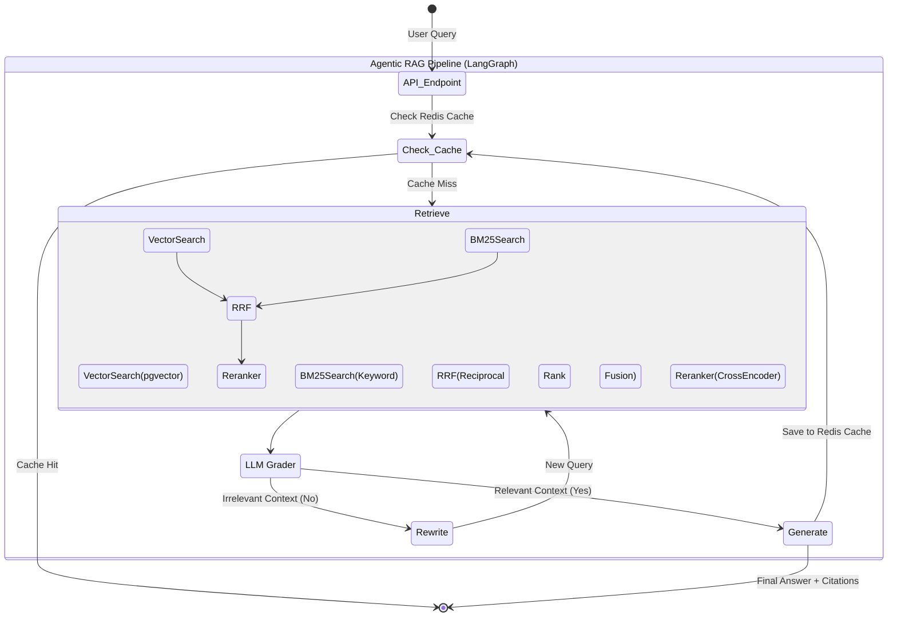

# Advanced Agentic RAG Knowledge Assistant

A portfolio-ready, production-grade Agentic Retrieval-Augmented Generation (RAG) system built with **FastAPI** and **LangGraph**. This system implements a self-reflective, self-correcting agent workflow using advanced hybrid retrieval techniques.

## 🌟 Key Features

* **Agentic Orchestration (LangGraph):** State-machine based routing that grades retrieval results, rewrites queries if needed, and iteratively searches until high-quality context is found.
* **Hybrid Retrieval:** Combines semantic Vector Search and keyword-based BM25 search.
* **Reciprocal Rank Fusion (RRF):** Intelligently merges results from dense and sparse retrieval methods.
* **Cross-Encoder Reranking:** Re-ranks the fused candidates using `BAAI/bge-reranker-base` to surface the absolute most relevant chunks.
* **Self-Reflective Grading:** Uses an LLM structured output to grade whether retrieved documents are actually relevant to the user query.
* **Query Rewriting:** Automatically reformulates poor queries based on context gaps to try searching again.
* **Robust Infrastructure:** Uses **PostgreSQL + pgvector** for persistent embeddings and vector similarity search, and **Redis** for semantic caching.
* **Containerized:** Fully deployable using Docker Compose.

---

## 🏛️ Architecture Workflow

The following diagram illustrates the agentic decision-making loop and the advanced retrieval pipeline:



## 🛠️ Technology Stack

* **API & Orchestration:** FastAPI, LangChain, LangGraph
* **Vector Database:** PostgreSQL with pgvector (fallback to FAISS for local CPU dev)
* **Caching:** Redis
* **Embedding & Reranking:** OpenAI Embeddings, Sentence-Transformers (BGE-Reranker)
* **Keyword Search:** rank-bm25
* **Evaluation Framework:** RAGAS ready

## 🚀 Getting Started

### 1. Prerequisites
* Docker and Docker Compose installed
* OpenAI API Key

### 2. Local Setup
1. Clone the repository and navigate into the project directory.
2. Copy the environment template:
   ```bash
   cp .env.example .env
   ```
3. Add your `OPENAI_API_KEY` to the `.env` file.
4. Place any PDF documents you want to ingest into `data/documents/`.
5. Start the full infrastructure (API, PostgreSQL, Redis) via Docker:
   ```bash
   docker compose up --build
   ```

### 3. Usage
Once running, the API is available at `http://localhost:8000`.

* **Interactive API Docs:** Open `http://localhost:8000/docs` (Swagger UI) to test endpoints directly.
* **Ingest Data:** Call `POST /ingest` to process, chunk, embed, and index your documents into PostgreSQL/pgvector.
* **Query the Agent:** Call `POST /ask` with your query to trigger the LangGraph RAG workflow.

## 🚀 Deployment
For a live portfolio demo, deploy the Dockerized container to an always-on cloud service (like AWS ECS, Render, or Railway) using managed PostgreSQL (with pgvector extension enabled) and managed Redis. Update your environment variables accordingly using the `.env.example` structure.
